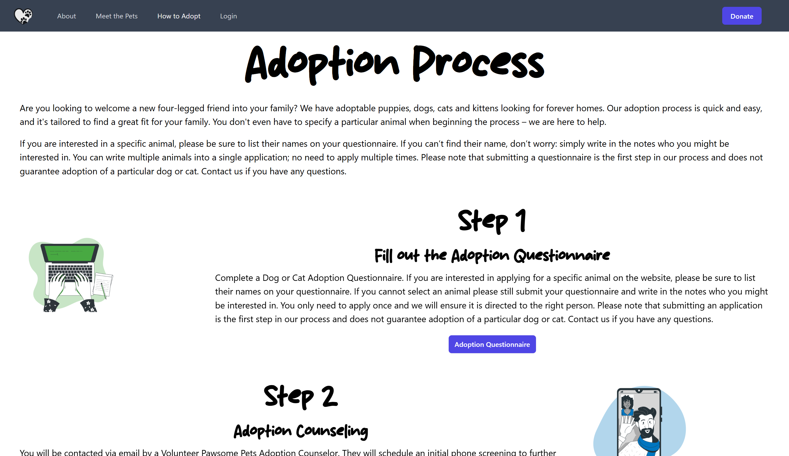

# Pawsome Pets Adoption Services


               
   
  ## Description  ✏️
  
  Match users with the pet of their dreams. 

  <hr/>

  React query handles state from server such as pet data. Auth status and user details client state is handled by Redux Toolkit. User details are encrypted and stored in sessionStorage for persistance across reloads. 

  React query optimistic UI makes favoriting and unfavoriting instant regardless of server time to response. Unfavoriting on the favorties page is also instant. Filtering by Dog vs Cat vs All uses the cache. 

  Client built with TailwindCSS and Headless UI for React.

  Zod was the original choice for user data validation, but then I found react-hook-form and used it for the contact page.

  Routing is done with React Router Dom.

  Sequelize is the ORM for a PostgreSQL database. Express is the server. Express Router for routing.

  This application uses session authentication with an axios response interceptor to redirect the user to login if session expires, but rolling is set to true with express-sessions so user should stay logged in until 5 min of inactivity.

  This app was originally designed with headless architecture, but Safari third party cookie rules made this too difficult for this project. 
  
  ## Table of Contents 📖
  
  [Installation](#installation)

  [Usage](#usage)

  

  [Issues](#known-issues)

  [Contributing](#how-to-contribute)

  [Tests](#tests) 

  [Credits](#credits)

  [Questions](#questions)
  
  ## Installation 
  
  To install necessary dependencies, run the following command:
  
  ```
  npm i
  ```
  
  ## Usage 
  
  Clone the repository, run the install command and then 'npm run dev'. Then navigate to the localhost port.

  ### Deployed Link
  

### Screenshots




______________________________________________________________________________________


## Known Issues 

- Pet data usually won't match pet image. I used fakerjs to generate fake data, and the point of this project is the coding, not the fake data.
- Again due to limits on time with fake data, I am not concerned with ages of kittens and puppies.

## How To Contribute 
  
Fork the repository and make a pull request with your new code.
  
## Tests 
  
To run tests, run the following command:
  
  ```
  npm test
  ```


## Credits 

Images of cats & dogs together by [Vecteezy.com](https://www.vecteezy.com/)<br/>
Thanks to [Lucky Dog Animal Rescue](https://www.luckydoganimalrescue.org/) for providing site content and loose specs for this project. <br/>
Custom fonts from [dafont.com](https://www.dafont.com/)

 ## Questions 
  
 If you have any questions about the repo or notice any bugs you want to report, open an issue or contact me directly at megan.meyers.388@gmail.com. 
  
  
